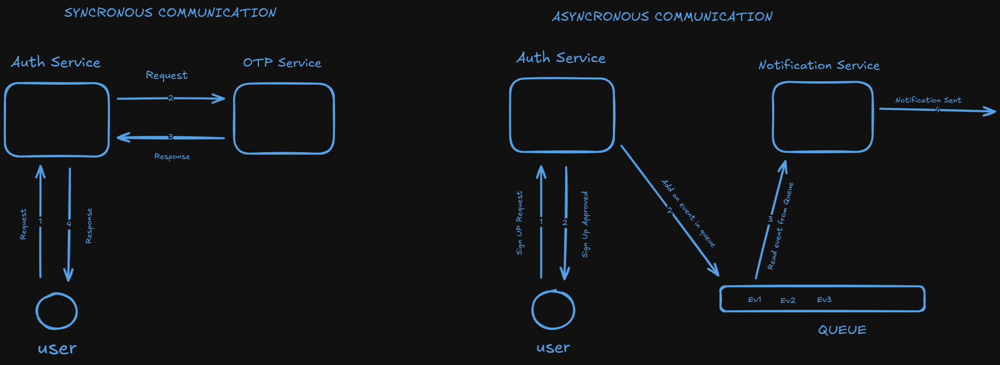

# http-on-diet

* A Server-2-Server communication Protocol, which allows services in a microservice architecture to communicate with each other without the extra burden/load of headers in a conventional HTTP connection

## BUT WHY?... 

* Generally in a microservice architecture, if 2 servers(or services) want to communicate with each other, we spin a HTTP(S) server on the services, and communicate using those api(HTTP) endpoints
* Here, we are using HTTP/HTTPS Protocol, which has a big overhead along with each request(HEADERS and others)

---
* Mostly, in an internal communication, security risks are less and we just need to communicate with a microservice
* And for this, adding the overhead of headers and all is not a good choice everytime
* So, to tackle this issue, we are building this basic S2S(Service-2-Service) Protocol

* 

## Solution
* We are building a light weight HTTP Protocol, i.e., Remove the Overhead from the HTTP and just send the TEXT(or DATA)
* We will use TCP Protocol and not HTTP
> NOTE - Its already a solved problem, using GRPC
* Refer, [GRPC](https://www.freecodecamp.org/news/what-is-grpc-protocol-buffers-stream-architecture/)
* Must Read, [Netflix GRPC](https://netflixtechblog.com/practical-api-design-at-netflix-part-1-using-protobuf-fieldmask-35cfdc606518)
